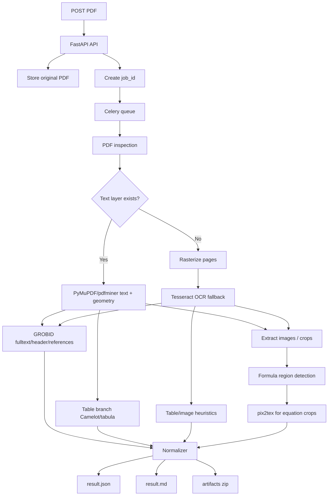
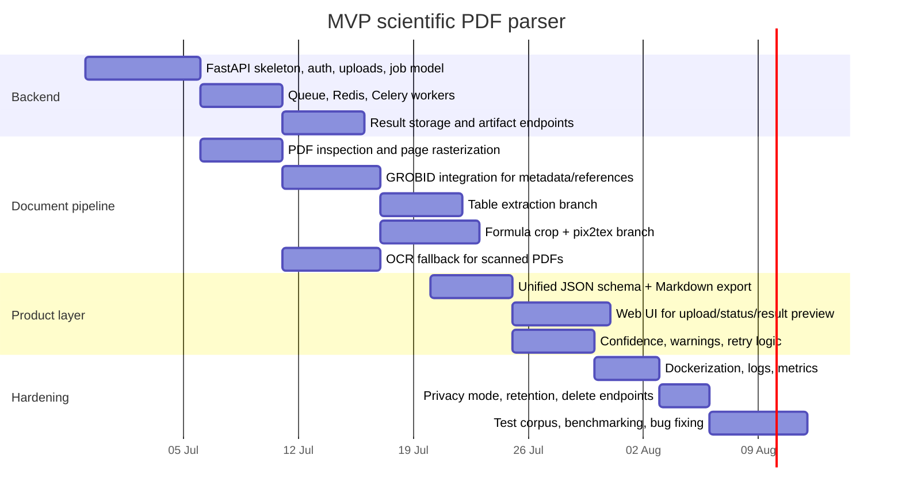

# Аналитический отчёт по веб‑сервису распознавания научных PDF

## Краткое резюме

Твоя задача — не просто “сделать OCR для PDF”. По сути, тебе нужно собрать **веб‑сервис уровня scientific document understanding**: он принимает PDF научной статьи, определяет, где в документе обычный текст, где формулы, где таблицы, где рисунки, где заголовок/авторы/аннотация/секции/список литературы, а затем возвращает результат в машиночитаемом виде — прежде всего в `JSON`, а также в `Markdown` и при необходимости в `LaTeX`/`tex`‑фрагментах. Для такого сервиса одной библиотеки недостаточно: почти всегда нужен **пайплайн из нескольких компонентов** — PDF parser, OCR-фолбэк для сканов, специализированный блок для формул, блок для таблиц и отдельный структурный парсер для метаданных статьи и библиографии. citeturn49view2turn35view1turn31view0turn49view0

Если цель — сделать **MVP за 6–8 недель**, то лучший путь не “писать всё с нуля”, а собрать **гибридную архитектуру**:  
**PyMuPDF / pdfminer.six / pypdf** для доступа к PDF и извлечения текста/изображений; **GROBID** для структуры статьи, секций и references; **Tesseract** как OCR-фолбэк для сканов; **pix2tex / LaTeX-OCR** только для вырезанных формульных регионов; **Camelot / tabula-py** для таблиц из text-based PDF; асинхронный backend на **FastAPI + Celery + Redis**, контейнеризация через **Docker**. Это даёт реалистичный баланс между скоростью разработки, качеством и контролем над приватностью. citeturn18view0turn18view1turn19view1turn49view2turn24view0turn19view4turn19view5turn44view1turn44view3

Если формулы — критически важная часть продукта, то в сравнении готовых сервисов **Mathpix остаётся наиболее специализированным вариантом**: у него есть PDF‑конвертация именно научных документов, Mathpix Markdown, LaTeX/Markdown/DOCX‑конверсии, API‑пример на Python/JS/Go/Java, page streaming через SSE и on‑prem/VPC deployment. При этом у Mathpix есть важные приватностные нюансы: по умолчанию API может сохранять запросы/ответы для QA, но это отключается через `improve_mathpix=false`; retention в policy — до 30 дней, если retention не отключён. citeturn35view1turn35view0turn47view5turn47view1turn47view0

Для **структуры статьи и библиографии** главным готовым OSS-компонентом остаётся **GROBID**: сервер возвращает **TEI XML** с header/body/bibliography, умеет извлекать references, добавлять координаты фигур/таблиц/формул, работать через Docker и сам по себе хорошо подходит именно для scholarly PDFs. Но GROBID не заменяет OCR математических формул с картинки: он силён в **document structure**, а не в общем visual OCR. citeturn49view2turn49view3turn50view0turn48view4

Для полностью открытого end-to-end подхода важны ещё две альтернативы. **Nougat** — официальный academic PDF parser от Meta, который “understands LaTeX math and tables”, но по документации лучше всего работает на английских научных статьях, а его model weights лицензированы **CC-BY-NC**, что ограничивает коммерческое использование. **Marker** очень быстро развивается, умеет PDF→Markdown+JSON и отдельное извлечение tables, но код лицензирован под **GPL-3.0**, а для commercial self-hosting авторы прямо указывают необходимость отдельной лицензии — это серьёзный продуктовый риск, если вам нужен закрытый коммерческий сервис. citeturn25view1turn23academia0turn25view2turn25view3turn25view4turn25view5

Самый важный вывод: **для MVP не надо сразу пытаться повторить весь Mathpix**. Нужно сделать узкий, но надёжный сервис для научных статей:  
**born-digital PDF → структура + текст + references + tables + images + вырезанные formulas + JSON/Markdown output**;  
**scanned PDF → OCR fallback + то же API, но с пометкой confidence и degraded mode**. Это реалистично для одного инженера или маленькой команды. citeturn37view1turn49view2turn31view0turn35view1

## Что на самом деле нужно сделать Еве

Если объяснить совсем по-человечески, то тебе нужно собрать сервис из пяти слоёв.

Во-первых, нужен **слой приёма и хранения документа**: загрузка PDF, валидация mime type, ограничение размера, постановка задачи в очередь, сохранение исходника в object storage и выдача `job_id`. FastAPI хорошо подходит для этого, потому что он из коробки заточен под upload endpoints, background tasks, OpenAPI и дальнейшее разворачивание с workers/containers. Для “тяжёлой” обработки одного встроенного background task обычно мало; для реальной нагрузки нужен отдельный task queue. citeturn41view0turn44view4turn44view1

Во-вторых, нужен **routing layer**, который определяет тип документа:  
`born-digital PDF` с текстовым слоем или `scanned PDF` как набор картинок. Это критично, потому что text-based PDF выгоднее обрабатывать парсерами PDF и структурными моделями, а сканы требуют rasterization + OCR. Библиотеки типа pypdf, PyMuPDF и pdfminer.six умеют извлекать текст, metadata, изображения и низкоуровневые объекты PDF, но не решают сами по себе задачу “понять научную статью как статью”. citeturn18view0turn18view1turn19view1turn22view4

В-третьих, нужен **слой document understanding**: из PDF надо получить title, authors, abstract, section headings, bibliography, mentions. Здесь лучше всего подходит GROBID, потому что он специально делает `processHeaderDocument`, `processFulltextDocument`, `processReferences` и возвращает TEI XML с богатой структурой; координаты можно включить через `teiCoordinates`, а при необходимости потом конвертировать TEI на клиентской стороне в JSON/Markdown. Science Parse тоже умеет title/authors/abstract/sections/bibliography в JSON, но это скорее академический/исторический baseline, а не основной кандидат для современного production MVP. citeturn49view2turn49view0turn49view1turn16view0

В-четвёртых, нужен **специализированный extraction layer**:  
обычный текст — одним путём, таблицы — другим, формулы — третьим, изображения — четвёртым. Camelot и tabula-py хороши для таблиц в text-based PDF, но Camelot сам предупреждает, что он работает только с text-based PDFs, а не со сканами. Для формул нужен отдельный распознаватель типа pix2tex / LaTeX-OCR; запускать его нужно не на всей странице, а только на регионах формул, иначе качество и скорость сильно падают. Для общей OCR-поддержки сканов лучше использовать Tesseract как baseline-фолбэк; Kraken имеет смысл скорее для исторических или нестандартных письменно-графических систем, а не как default для современных англоязычных scientific PDFs. citeturn19view4turn19view5turn24view0turn20view0turn20view1

В-пятых, нужен **output layer**: согласованный JSON, плюс удобный Markdown и экспорт артефактов. У Commercial OCR API это уже есть: например, Mistral OCR возвращает `pages[].markdown`, `images`, `tables`, `header`, `footer`, `dimensions`, `confidence_scores`; Mathpix возвращает Mathpix Markdown и даёт поточное получение page-level JSON через SSE. Для твоего собственного MVP это хороший ориентир по форме API и формату результатов. citeturn31view0turn34view4turn35view1

Иными словами: **не “сервис распознавания PDF”**, а **асинхронный веб‑конвейер для разбора научной статьи на структурированные сущности**. Это и есть правильная формулировка задания. citeturn49view2turn31view0turn35view1

## Коммерческие сервисы и готовые API

Сначала важная оговорка: **Science Parse не стоит ставить в один ряд с Mathpix/AWS/Google/Azure как коммерческий managed service**. По официальному репозиторию это open-source/academic parser AllenAI, который парсит статьи в structured JSON и может быть поднят как server/CLI/library. Поэтому ниже я рассматриваю Science Parse в OSS-блоке, а в коммерческий блок включаю реальные managed/document AI сервисы. citeturn16view0

### Сравнение сервисов

| Сервис | Что умеет лучше всего | Формулы | Таблицы / изображения / структура | Pricing | Лимиты / hosting / privacy | SDK / языки | Главные плюсы | Главные минусы | Источник |
|---|---|---|---|---|---|---|---|---|---|
| **Mathpix Convert API** | Scientific PDF → Markdown / LaTeX / DOCX, math-heavy docs | **Сильная специализация на LaTeX math**; маркетинг прямо акцентирует equations и PDF→LaTeX/Markdown citeturn17view4turn47view1 | Есть table OCR, PDF conversion, page-level confidence, streaming SSE; on-prem/VPC option citeturn35view1turn47view1 | От **$0.002/image** для Convert API; enterprise/SCS — custom citeturn17view2turn17view4 | По policy: retention до 30 дней, opt-out через `improve_mathpix=false`; on-prem/VPC; SOC 2 Type 2 citeturn47view5turn47view1turn47view0 | Примеры: Python, JS/TS, Go, Java; есть Python SDK citeturn35view1turn35view0 | Лучший fit под scientific PDFs и formulas; есть private deployment | Публичных строгих benchmark-метрик по formula CER/ExpRate в docs нет; vendor lock-in | citeturn35view1turn47view5turn47view1turn47view0 |
| **Mistral OCR 4** | PDF/Image → Markdown + tables/images + confidence scores | В docs нет упора на LaTeX output; скорее document OCR/understanding, чем formula-first сервис citeturn31view0turn33view0 | Markdown output, table/html/markdown formats, image placeholders, header/footer extraction, confidence score; multilingual 40+ languages citeturn31view0turn34view4 | **$4 / 1000 pages**, Batch API **$2 / 1000 pages**, Document AI **$5 / 1000 pages** citeturn33view0turn33view3 | Enterprise deployments: self-hosted / private cloud / on-prem stated on pricing page citeturn32view1 | Python, TypeScript, curl examples citeturn34view4 | Очень удобный JSON/Markdown output; современный API | Научные формулы и bibliography хуже документированы, чем у Mathpix/GROBID | citeturn31view0turn33view0turn34view4turn32view1 |
| **Google Document AI Enterprise OCR / Layout Parser** | OCR + layout parsing на managed cloud | Есть `enable_math_ocr`, docs показывают `math_formula` visual elements, но это не равно готовому LaTeX-centric scientific parser citeturn38view0turn38view3 | Detect blocks/paragraphs/lines/words/symbols; native PDF parsing; supported regions include `eu` and `us` for relevant processors citeturn37view1turn37view3 | Official pricing page есть, но в собранных статических фрагментах точные ставки по нужным процессорам не удалось надёжно зафиксировать; pricing processor-specific citeturn9view0 | Typical per-processor page limits: 15 pages sync, up to 1000 async for some processors; regional deployment available (`eu`, `us`, etc.) citeturn37view0turn37view3 | В извлечённых docs явно показан Python API sample; REST тоже есть citeturn38view0turn38view3 | Хороший managed OCR + math add-on + native PDF parsing | Для bibliography/section/reference extraction понадобится поверх этого ещё логика; pricing сложнее считать | citeturn37view1turn37view0turn38view0turn38view3 |
| **Azure AI Document Intelligence** | Layout, paragraphs, tables, figures, sections, markdown | На pricing page formula указан как add-on feature; но docs не показывают LaTeX-oriented scholarly pipeline citeturn13view0turn34view3 | Layout model extracts paragraphs, tables, figures, sections, markdown; good structured document output citeturn34view3 | Free tier 0–500 pages/month; page pricing region-dependent, static HTML не раскрыл точные значения; formula/font/high-res — add-ons citeturn13view0 | Default S0: 15 TPS analyze, 2000 pages, 500 MB; есть containers, но стандартные контейнеры требуют Azure billing connectivity citeturn36view0turn13view4 | C#, Python, Java, JavaScript, REST, Studio citeturn34view3 | Сильный layout API и понятные SDK | Формулы не центральная компетенция; privacy model слабее, чем у fully self-hosted OSS | citeturn34view3turn36view0turn13view0turn13view4 |
| **AWS Textract** | OCR + forms/tables/layout на AWS | В reviewed docs явной поддержки formula OCR / LaTeX нет; сервис ориентирован на text/forms/tables/lending/ID workflows citeturn14view3turn14view5 | Text, handwriting, forms, tables, layout; sync PDF/TIFF only 1 page, async up to 3000 pages / 500 MB citeturn14view2turn14view1 | Example price: Detect Document Text **$0.0015/page**; Analyze Document Tables first 1M pages **$0.015/page** in US West (Oregon) examples citeturn14view3turn14view5 | Managed AWS cloud; free tier 3 months with page caps citeturn14view5 | Standard AWS API model; detailed SDK language matrix в извлечённых страницах не зафиксировалась | Хороший generic OCR/document extraction | Для scientific formulas — плохой fit; bibliography/title/sections придётся строить отдельно | citeturn14view3turn14view1turn14view5 |
| **GROBID as a service** | На практике — не managed SaaS, а self-hosted scholarly parser | Не OCR-сервис формул; умеет координаты formula в TEI, но core value — structure parsing citeturn49view3 | Header/body/bibliography/references in TEI XML; Docker deployment citeturn49view2turn50view0 | OSS, Apache 2.0 citeturn48view4 | Self-hosted | Java server + Python client converters to JSON/Markdown citeturn49view2turn16view0 | Лучший OSS для структуры статьи | Не заменяет OCR формул и не даёт managed cloud convenience | citeturn49view2turn50view0turn48view4 |

### Что из этого реально подходит под твой кейс

Если цель — **быстро сделать MVP**, то есть три реалистичных сценария.

**API-first MVP.**  
Самый быстрый путь — взять Mathpix или Mistral как основной engine и вокруг него построить свой backend/UI, job queue, storage, normalized JSON schema и human review. Это даёт минимальный time-to-demo. Если формулы — ключевой selling point, у Mathpix выше вероятность “выглядеть как надо” на научных статьях, потому что у него продуктовая специализация именно на scientific PDFs и equation-to-LaTeX workflows. citeturn17view4turn35view1turn47view1turn31view0

**Hybrid MVP.**  
Самый здравый вариант для дипломно‑проектного или продуктового старта — держать **GROBID + PDF parsers + OCR/fallbacks** у себя, а внешний API использовать только там, где open-source явно проигрывает: например, на тяжёлых формулах или на exceptionally messy scans. Такой вариант снижает стоимость и vendor lock‑in, но оставляет “страховку”, когда OSS пайплайн не справляется. citeturn49view2turn24view0turn19view4

**Full self-hosted.**  
Это лучший путь для privacy-sensitive данных и гибкости, но не лучший для 6–8 недель, если ты одна. Особенно тяжёлым становится блок formula OCR и качество на scanned scientific PDFs. В таком режиме GROBID + PyMuPDF + Tesseract + pix2tex — это реалистичный набор, но не нужно обещать клиентам “Mathpix-level parity” с первого релиза. citeturn50view0turn24view0turn20view0

## Open-source компоненты и библиотеки

### Базовые PDF и структурные компоненты

| Инструмент | Категория | Язык / runtime | Лицензия | Что даёт | Где хорош | Где слаб | Интеграция |
|---|---|---|---|---|---|---|---|
| **pypdf** | PDF parser | Python | В docs/repo позиционируется как free/open-source pure-Python library; repo содержит LICENSE file citeturn18view0turn21view0 | Text, metadata, images, splitting/merging/encryption, pure Python citeturn18view0turn21view0 | Простая интеграция, без native deps | Слабее на сложном layout и координатах, чем PyMuPDF/pdfminer | **Очень лёгкая** |
| **PyMuPDF** | High-performance PDF access | Python | Коммерчески управляемый licensing stack Artifex; docs прямо указывают license notice citeturn18view1turn19view0 | High-performance extraction, images, text, OCR guide, multiprocessing, geometry APIs citeturn18view1 | Лучший “рабочий ослик” для rasterization и page geometry | Не извлекает сам по себе scholarly semantics | **Лёгкая / средняя** |
| **pdfminer.six** | Low-level text/layout extraction | Python | **MIT** citeturn22view0turn22view4 | Text, images, font names/sizes, exact locations, color, TOC, tagged contents citeturn19view1turn22view4 | Нужен, когда важны координаты и low-level text features | Медленнее и менее ergonomic, чем PyMuPDF | **Средняя** |
| **GROBID** | Structure parser for scholarly docs | Java service; Python client exists; JVM languages possible citeturn16view0turn49view2 | **Apache 2.0** citeturn48view4 | Header/body/bibliography to TEI XML; references; coordinates; sentence segmentation; Docker citeturn49view2turn49view3turn50view0 | Лучший OSS для metadata/sections/references | Не general OCR engine for scans/formulas | **Средняя** |
| **Science Parse** | Academic parser | Java/Scala; library/server/CLI for JVM languages citeturn16view0 | **Apache-2.0** citeturn16view0 | Title, authors, abstract, sections, bibliography, mentions in JSON citeturn16view0 | Лёгкий baseline на structured metadata | Меньше возможностей и ecosystem, чем GROBID | **Средняя** |

Главная мысль здесь такая: **pypdf / PyMuPDF / pdfminer.six — не конкуренты GROBID**, а нижний слой. Они нужны, чтобы читать PDF как контейнер, резать страницы, доставать картинки, понимать координаты. А **GROBID / Science Parse** нужны, чтобы понимать PDF как **научную статью**. Самый практичный стек — комбинировать их, а не выбирать что‑то одно. citeturn18view0turn18view1turn22view4turn49view2turn16view0

### OCR, таблицы и формулы

| Инструмент | Категория | Язык / runtime | Лицензия | Что даёт | Где хорош | Где слаб | Интеграция |
|---|---|---|---|---|---|---|---|
| **Tesseract** | OCR baseline | C++ engine, bindings in many langs | В docs это официальный open OCR engine with publications/manual, но в извлечённых фрагментах license detail не зафиксирован citeturn20view0turn22view5 | Generic OCR for scans and images | Хороший baseline/fallback | Научные формулы и сложный scholarly layout — не его сильная сторона | **Средняя** |
| **Kraken** | OCR/ATR | Python API + CLI | **Apache 2.0** citeturn20view1 | Trainable layout analysis, reading order, recognition, multiple XML outputs | Historical / non-Latin / low-resource docs | Overkill для обычных современных articles; не default choice | **Средняя / сложнее** |
| **Camelot** | Table extraction | Python | **MIT** citeturn22view1turn22view3 | Extract tables to DataFrame; metrics; CSV/JSON/HTML/Markdown/SQLite | Text-based PDF tables | **Не работает со сканами** citeturn19view4 | **Лёгкая** |
| **tabula-py** | Table extraction | Python wrapper over Java | **MIT** citeturn22view2 | Wrapper over `tabula-java`; PDF tables → DataFrame / CSV / TSV / JSON citeturn19view5turn22view2 | Простой fallback для таблиц | Требует Java; качество зависит от исходного PDF | **Лёгкая / средняя** |
| **pix2tex / LaTeX-OCR** | Formula image → LaTeX | Python, CLI, GUI, API, Docker | **MIT** citeturn24view0 | Image of formula → LaTeX; Python API; Docker/API demo available citeturn24view0 | Лучший open-source блок именно под отдельные формулы | Не нужно пускать на всю страницу; нужны хорошие crops | **Средняя** |
| **Im2LaTeX family** | Research baseline for formula OCR | ML research models | Paper-level research baseline | Encoder-decoder image-to-markup; foundational benchmark for formula OCR citeturn28academia0turn24view2 | Для кастомного R&D и понимания state of the art | Не turnkey production library “из коробки” | **Сложная** |
| **TrOCR** | Generic OCR model | Transformers / Python | Depends on checkpoint packaging; docs show HF integration | End-to-end text recognition in Transformers; published paper + official HF docs citeturn23academia2turn27view0 | Хорош как generic OCR baseline or fallback | Не специализирован под formulas/tables/sections | **Средняя** |
| **Nougat** | End-to-end academic PDF parser | Python | Code **MIT**, model weights **CC-BY-NC** citeturn25view1 | Official academic parser that “understands LaTeX math and tables”; CLI/API extras citeturn25view1turn23academia0 | Очень интересен для research-grade PDF→markup | Лучше работает на English scientific papers; non-commercial weight license риск для products | **Средняя / сложная** |
| **Marker** | PDF → Markdown + JSON | Python 3.10+ | **GPL-3.0**, commercial self-hosting requires license citeturn25view2turn25view3turn25view4 | Fast, modern converter; supports programmatic block/table extraction citeturn25view5 | Быстро получить полезный end-to-end результат | GPL/commercial constraints для product MVP | **Лёгкая / средняя** |

### Практический вывод по OSS

Если бы мне нужно было собрать **наиболее рациональный open-source MVP**, я бы не строил его ни на одном “магическом” e2e-пакете. Я бы использовал:

- **PyMuPDF** как главный page engine  
- **pdfminer.six** там, где нужны точные текстовые координаты/шрифты  
- **GROBID** как scholarly structure service  
- **Camelot + tabula-py** для таблиц в born-digital PDF  
- **Tesseract** как OCR fallback  
- **pix2tex** только для formula crops  

Такой стек проще контролировать, дебажить и постепенно улучшать, чем сразу завязаться на один огромный end‑to‑end инструмент. Nougat и Marker я бы рассматривал как **альтернативные/экспериментальные ветки**:  
Nougat — если вы хотите academic PDF→markup эксперимент и вас устраивают license/language ограничения;  
Marker — если нужна сверхбыстрая демка, но вы осознанно принимаете GPL/commercial self-host implications. citeturn18view1turn22view4turn49view2turn19view4turn24view0turn25view1turn25view2

## Архитектурные варианты сервиса

Для такого продукта есть три разумных архитектурных паттерна.

### API-first архитектура

Это тонкий backend, который принимает PDF, кладёт задачу в очередь, вызывает внешний OCR/document AI API, затем нормализует ответ в свой внутренний `JSON schema` и показывает результат в UI. Это самая быстрая дорога к working product. FastAPI даёт upload endpoints, docs, CORS и security primitives; Celery даёт task queues с workers/broker model и горизонтальное масштабирование; Docker даёт повторяемое развёртывание в контейнерах. citeturn41view0turn44view1turn44view3

Плюсы этого пути: быстрое демо, меньше ML/infra боли, быстрее выглядит “магически”. Минусы: цена на странице/документе, зависимость от внешнего vendor, менее прозрачная privacy story. Для формул такой путь оправдан, если вам критично сразу показывать высокое качество. citeturn17view4turn33view0turn47view5

### Hybrid архитектура

Здесь собственный backend решает две задачи:  
он сам делает дешёвый/контролируемый parsing большинства статей, а внешние API подключает как **fallback** или как **premium path**. Например:

- PDF opened via PyMuPDF  
- если текстовый слой хороший → GROBID + Camelot + image extraction  
- если страница scan-like → OCR branch  
- если обнаружен dense formula region → pix2tex or vendor fallback  
- если итоговый confidence низкий → отправить проблемные страницы во внешний API  

Это обычно лучший инженерный компромисс. Он снижает среднюю стоимость и даёт контроль над data flow, но при этом спасает качество на edge-cases. Для one-person MVP это особенно важно: ты не пытаешься победить все PDF мира сразу, ты выстраиваешь **degradation strategy**. Поддержку page-level confidence удобно подсматривать у Mathpix и Mistral, потому что оба сервиса явно работают с per-page result semantics. citeturn35view1turn31view0

### Full self-hosted архитектура

Это путь, если privacy и data governance важнее всего. Здесь весь inference идёт внутри вашей инфраструктуры: GROBID через Docker, formula OCR локально, object storage локально или в своём VPC, OCR workers под вашим контролем. GROBID официально поддерживает Docker и описывает ресурсы памяти, включая рекомендации вплоть до 4–8 GB RAM в зависимости от нагрузки и режима обработки. Mathpix тоже предлагает VPC/on-prem deployment для enterprise, а Mistral указывает private cloud/on-prem deployment в enterprise part pricing page; это полезно как ориентир, что такой режим вообще рыночно востребован. citeturn50view0turn47view1turn32view1

Минус здесь один, но большой: **сложность**. Полностью self-hosted scientific OCR с формулами — это уже не “API wrapper”, а полноценная document AI система. Для первого релиза это обычно избыточно, если только privacy не является жёстким требованием. citeturn24view0turn49view2turn20view0

### Рекомендованный стек

Для MVP я рекомендую такой технологический стек:

- **Backend**: FastAPI  
- **Async / queue**: Celery + Redis  
- **Storage**: S3-compatible object storage для исходников и артефактов, Postgres для job metadata  
- **Workers**: отдельные CPU workers для parsing/OCR, optional GPU worker для formula OCR  
- **Parsing**: PyMuPDF + pdfminer.six + GROBID  
- **OCR fallback**: Tesseract  
- **Formula OCR**: pix2tex  
- **Tables**: Camelot first, tabula-py fallback  
- **Deployment**: Docker Compose для dev, далее Kubernetes/Nomad/managed containers по мере роста  

Это не просто “популярный” стек — он совпадает с тем, как сами documentation ecosystems описывают production pattern: API layer отдельно, queue отдельно, workers отдельно, containerized deployment отдельно. citeturn41view0turn44view1turn44view3turn50view0

## Рекомендуемый MVP

### Что должен делать MVP

MVP не обязан быть “идеальным Mathpix-клоном”. Но он должен надёжно закрывать **основной контракт**:

1. принять PDF;  
2. определить тип входа — text PDF или scan;  
3. извлечь title / authors / abstract / sections / references;  
4. извлечь page text;  
5. найти и вытащить tables и images;  
6. распознать формулы хотя бы как отдельные LaTeX fragments;  
7. вернуть всё это в одном нормализованном ответе;  
8. хранить confidence и diagnostic flags.  

Такой MVP уже выглядит как реальный продукт. citeturn49view2turn31view0turn35view1

### Рекомендуемый data flow



Этот пайплайн хорош тем, что он допускает **замены по частям**. Если потом захочешь тестировать Nougat, Marker или внешний API, ты просто меняешь ветку `formula / OCR / normalization`, а не переписываешь весь сервис. citeturn49view2turn24view0turn25view1turn25view2

### Предлагаемые API endpoints

Ниже — минимальный API-контракт, который реально нужен.

```http
POST   /v1/jobs
GET    /v1/jobs/{job_id}
GET    /v1/jobs/{job_id}/result.json
GET    /v1/jobs/{job_id}/result.md
GET    /v1/jobs/{job_id}/artifacts.zip
POST   /v1/jobs/{job_id}/retry
DELETE /v1/jobs/{job_id}
GET    /healthz
GET    /readyz
```

`POST /v1/jobs` должен принимать multipart upload и параметры вроде:

```json
{
  "extract_tables": true,
  "extract_images": true,
  "extract_formulas": true,
  "ocr_mode": "auto",
  "output_formats": ["json", "md"],
  "language_hint": "en",
  "privacy_mode": "standard"
}
```

`GET /v1/jobs/{job_id}` должен возвращать состояние:

```json
{
  "job_id": "uuid",
  "status": "queued|processing|completed|failed|partial",
  "progress": 0.64,
  "pages_total": 18,
  "pages_done": 12,
  "warnings": [
    "ocr_fallback_used",
    "low_confidence_formulas_on_pages_7_8"
  ]
}
```

А канонический `result.json` должен быть примерно таким:

```json
{
  "document_id": "uuid",
  "source": {
    "filename": "paper.pdf",
    "pages": 18,
    "born_digital": true
  },
  "metadata": {
    "title": "...",
    "authors": ["..."],
    "abstract": "...",
    "keywords": [],
    "doi": null
  },
  "sections": [
    {
      "title": "Introduction",
      "level": 1,
      "text": "...",
      "pages": [1, 2]
    }
  ],
  "formulas": [
    {
      "page": 4,
      "bbox": [x1, y1, x2, y2],
      "latex": "\\int ...",
      "confidence": 0.87
    }
  ],
  "tables": [
    {
      "page": 6,
      "bbox": [x1, y1, x2, y2],
      "markdown": "|...|",
      "csv_path": "tables/table_1.csv"
    }
  ],
  "figures": [
    {
      "page": 5,
      "bbox": [x1, y1, x2, y2],
      "image_path": "figures/fig_1.png"
    }
  ],
  "references": [
    {
      "raw": "...",
      "title": "...",
      "authors": ["..."],
      "year": 2024
    }
  ],
  "pages": [
    {
      "page": 1,
      "text": "...",
      "markdown": "...",
      "confidence": 0.95
    }
  ],
  "diagnostics": {
    "ocr_used": false,
    "grobid_used": true,
    "formula_engine": "pix2tex"
  }
}
```

### Error handling

В этом продукте ошибка — это не только `500`. Часто обработка должна завершаться как **partial success**. Например:

- `completed_with_warnings` — статья распарсена, но formulas low-confidence  
- `partial` — metadata и text есть, но tables failed  
- `failed_validation` — плохой mime type / encrypted PDF / oversized file  
- `failed_processing` — corrupted PDF / OCR timeout / GROBID unavailable  

Для GROBID отдельно надо учитывать, что документация прямо описывает `503`, когда все threads заняты, и рекомендует retry после short wait. Это значит, что твой worker должен поддерживать автоматический retry/backoff на такие ошибки. citeturn49view2turn48view2

### Performance targets

Ниже — **не обещания vendor-а, а инженерные целевые ориентиры для MVP**:

- upload → `job_id`: **< 300 ms**
- 10–20 page born-digital paper: **20–60 секунд**
- 10–20 page scanned paper: **60–180 секунд**
- отдельная страница формулы через crop→pix2tex: **сотни миллисекунд – несколько секунд**, в зависимости от batch/GPU
- time-to-first-preview: сначала показать metadata + первые страницы + warnings, затем добирать tables/formulas асинхронно

Это даёт пользователю ощущение “сервис живой”, даже если полный batch ещё идёт.

### Оценка effort и стоимости

Это уже оценка, а не официальная pricing quote.

| Вариант | Что внутри | Срок на MVP | Стоимость инфраструктуры | Стоимость API usage | Риск |
|---|---|---:|---:|---:|---|
| **Low** | Mathpix или Mistral как основной engine + свой API/UI | 2–4 недели | низкая | средняя / высокая | vendor lock-in |
| **Medium** | Hybrid: GROBID + PyMuPDF + Camelot + Tesseract + pix2tex, vendor fallback optional | **6–8 недель** | средняя | низкая / выборочная | **лучший баланс** |
| **High** | Почти всё self-hosted, включая тяжёлый OCR/formula path | 8–16+ недель | средняя / высокая, особенно с GPU | низкая | высокий R&D риск |

Для твоей постановки я бы выбирал **Medium**. Это ровно тот диапазон, где можно успеть сделать что‑то реально демонстрируемое и не развалиться на сложности.

## Интеграция компонентов и альтернативные пайплайны

### Практический пайплайн для MVP

Самая здравая комбинация выглядит так:

**born-digital PDF**  
`PyMuPDF/pdfminer.six → GROBID → Camelot/tabula → image extraction → formula crop detection → pix2tex → normalization`

**scanned PDF**  
`PyMuPDF rasterization → Tesseract OCR → GROBID on OCR text or structure heuristics → tables/images/formulas branches → normalization`

Логика простая. GROBID лучше всего работает там, где структура статьи ещё читаема как scholarly document. Tesseract нужен не как “главный мозг”, а как способ вернуть текстовый слой туда, где его нет. pix2tex нужен не для whole-page OCR, а для отдельных математических регионов. Camelot и Tabula лучше включать только там, где PDF text-based, потому что Camelot сам это явно оговаривает. citeturn18view1turn19view1turn49view2turn20view0turn24view0turn19view4

### Альтернативный пайплайн с e2e parser

Есть и другой путь:

**PDF → Nougat / Marker → post-processing → GROBID/reference enrichment (optional)**

Он хорош для экспериментов, потому что может быстрее дать “красивый Markdown”. Но у него есть две проблемы.

Первая — **licensing/product risk**. У Nougat weights под CC-BY-NC, у Marker GPL-3 и отдельно оговорён commercial self-hosting license. Для лабораторного исследования это ок; для продукта надо очень внимательно смотреть юридическую модель. Вторая — **управляемость качества**. Когда один большой e2e parser делает “всё сразу”, сложнее локально чинить один именно болящий участок — например, только tables или только references. citeturn25view1turn25view2turn25view4

### Что не стоит делать на первом этапе

Не стоит на MVP:

- обучать собственную formula model с нуля по Im2LaTeX-подобному pipeline;  
- пытаться сделать идеальный bibliography linker и citation resolution;  
- делать полноценную visual formula detector своим CV stack’ом, если можно начать с heuristics + explicit crops;  
- обещать “100% Mathpix accuracy on all PDFs”.

Im2LaTeX и современные MER papers важны как R&D reference, но это не самый короткий путь к работающему продукту. Papers полезны, чтобы понимать направление, но не как first implementation plan. citeturn28academia0turn23academia2turn23academia0

### Gantt для MVP на 6–8 недель



## Следующие шаги, чеклист и ограничения

### Что я рекомендую сделать прямо сейчас

Самый правильный следующий шаг — **сузить MVP contract**. Не “распознавать любой PDF”, а:

> “Принимать научные PDF-статьи и возвращать:  
> text, title, authors, abstract, sections, references, tables, images, equation LaTeX fragments.”

Это уже достаточно амбициозно, но ещё реально. Дальше — сразу выбрать **hybrid архитектуру** как базовую: GROBID + PyMuPDF + OCR fallback + formula branch. Это даст тебе понятный backlog и избавит от ловушки “я ищу одну идеальную библиотеку”. Такой библиотеки здесь нет. citeturn49view2turn18view1turn24view0

### Короткий чеклист для Евы

- [ ] Поднять **FastAPI** сервис с `POST /v1/jobs` и `GET /v1/jobs/{id}`  
- [ ] Добавить **Celery + Redis** для асинхронной обработки  
- [ ] Реализовать PDF inspection: `born-digital` vs `scanned`  
- [ ] Подключить **GROBID** для metadata/sections/references  
- [ ] Подключить **PyMuPDF** для page rendering и image extraction  
- [ ] Подключить **Camelot/tabula-py** для таблиц text-based PDF  
- [ ] Подключить **Tesseract** как OCR fallback  
- [ ] Подключить **pix2tex** для formula crops  
- [ ] Спроектировать единый `result.json` и `result.md`  
- [ ] Добавить status/progress/confidence/warnings  
- [ ] Добавить delete endpoint и retention policy  
- [ ] Собрать тестовый набор из 20–30 реальных статей: arXiv, 2-column PDFs, scans, formula-heavy papers

### Что я бы выбрал как основной recommendation

**Рекомендованный MVP stack:**  
**FastAPI + Celery + Redis + PyMuPDF + pdfminer.six + GROBID + Camelot + Tesseract + pix2tex + Docker**

**Почему именно он:**  
он покрывает все обязательные сущности твоего задания, остаётся контролируемым, не запирает тебя полностью в vendor API, и укладывается в 6–8 недель как нормальный инженерный проект. Если потом захочешь повысить качество формул или messy scanned docs, можно точечно добавить Mathpix или Mistral на fallback-ветку — без переделки всего сервиса. citeturn41view0turn44view1turn18view1turn49view2turn24view0turn19view4

### Открытые вопросы и ограничения

В исследованных официальных docs есть несколько мест, где нужно быть честным об ограничениях.

Во-первых, **публичные строгие benchmark-метрики именно по formula/LaTeX accuracy** у крупных managed сервисов почти не публикуются в том виде, который позволил бы сделать честное apples-to-apples сравнение. У Mathpix и Nougat есть явная продуктовая/исследовательская специализация на math-heavy docs, а у Google/Azure формульная поддержка присутствует, но чаще как часть OCR add-ons, а не как подробно документированный scholarly LaTeX benchmark. citeturn47view1turn23academia0turn38view0turn13view0

Во-вторых, **pricing у Google Document AI и Azure Document Intelligence** в retrieved static fragments оказался частично динамическим/region-dependent. Поэтому их надо проверять ещё раз перед финальным бюджетом в вашем регионе, даже если архитектурное решение уже принято. AWS, Mistral и Mathpix в полученных страницах позволяли надёжнее зафиксировать pricing fragments. citeturn9view0turn13view0turn14view3turn33view0turn17view4

В-третьих, для privacy-sensitive use cases надо отдельно решить, какой у вас режим:  
**public cloud**, **private VPC**, **on-prem**,  
и насколько жёстко нужно ограничивать retention, human access, audit logs и экспорт данных. Mathpix, GROBID и Mistral дают разные по силе варианты hosting control, но operational/legal модель надо зафиксировать в начале проекта, а не после первой демки. citeturn47view1turn47view5turn50view0turn32view1